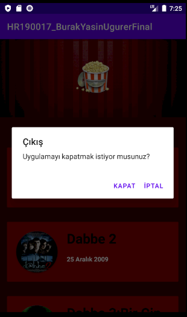

# hr190017burakyasinugurer

<h1> Uygulama Hakkında Bilgi</h1>
<h5>Projemiz 6 seriden oluşan "DABBE" adlı filmi konu almaktadır.Bu film serisi hakkında bilgi almak için Liste ekranında bulunan yuvarlak resimlere tıklayarak bilgi alabilirsiniz.Bilgilerin içeriği Çıkış tarihi,konusu,oyuncuları,yönetmeni gibi temel bilgilerdir</h5>
<h1> Uygulamanın Ekran Çıktıları</h1>

    

<h1> Projenin Mimari Yapısı</h1>

<h1> Projede kullanılan teknolojiler </h1>
<ol>
  <li><a href="https://github.com/bumptech/glide">Glide<a/></li>
  <li><a href="https://github.com/ReactiveX/RxJava">RxJava</a></li>
  <li><a href="https://github.com/square/okhttp">Okhttp</a></li>
  <li><a href="https://github.com/square/retrofit">Retrofit2</a></li>
</ol>

<h1> Lisans </h1>

<h3>Copyright 2020 Burak Yasin UĞURER.</h3>

Licensed under the Apache License, Version 2.0 (the "License"); you may not use this file except in compliance with the License. You may obtain a copy of the License at

http://www.apache.org/licenses/LICENSE-2.0

Unless required by applicable law or agreed to in writing, software distributed under the License is distributed on an "AS IS" BASIS, WITHOUT WARRANTIES OR CONDITIONS OF ANY KIND, either express or implied. See the License for the specific language governing permissions and limitations under the License.
